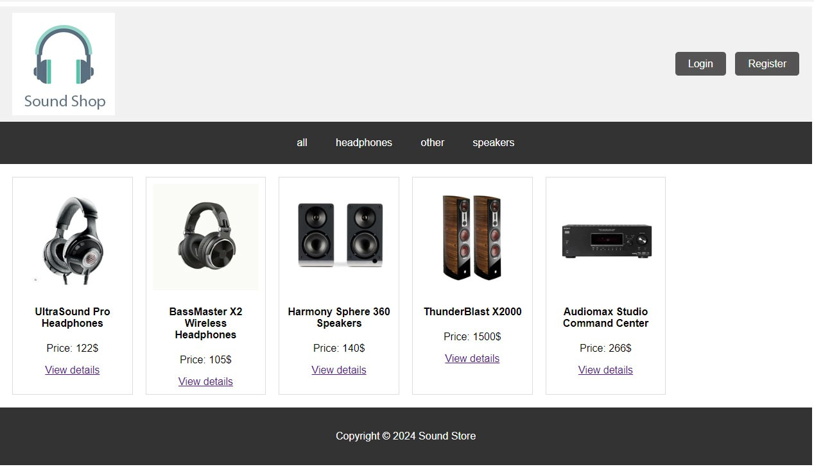
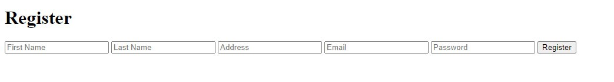
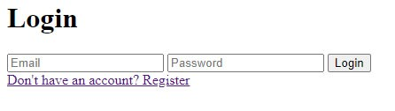
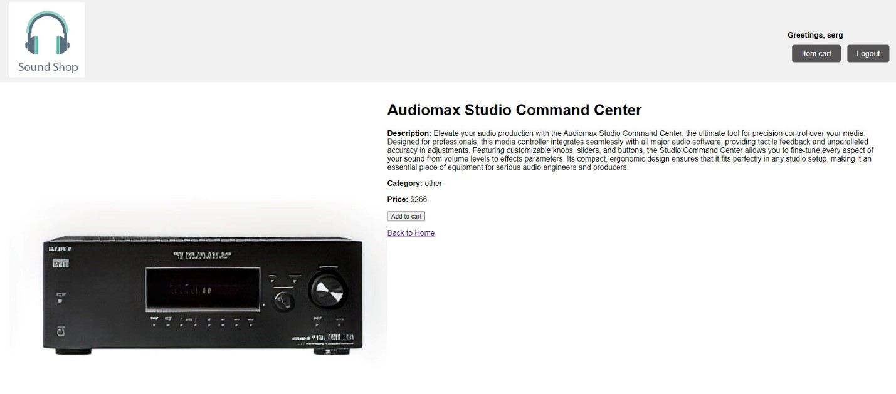
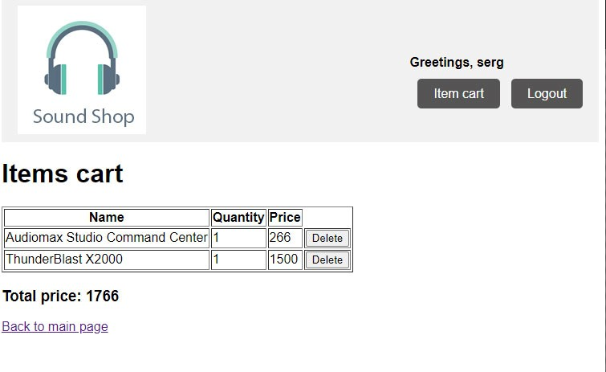
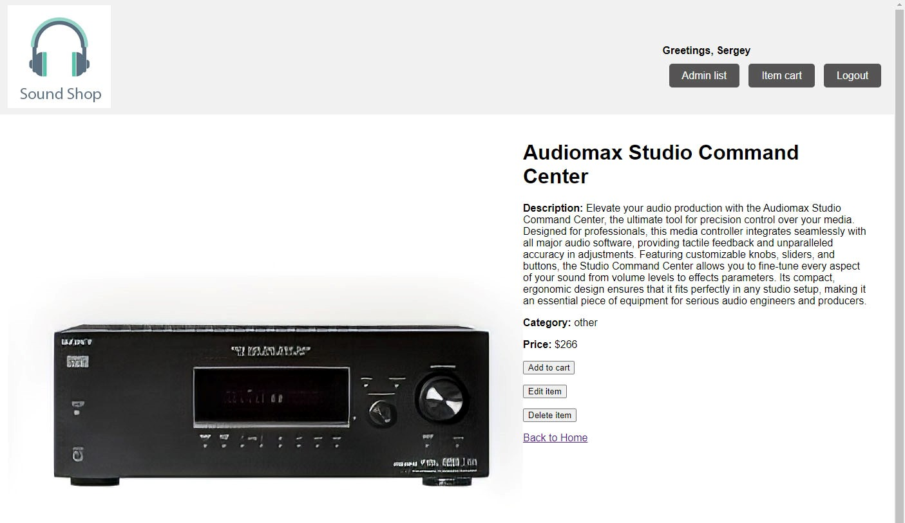
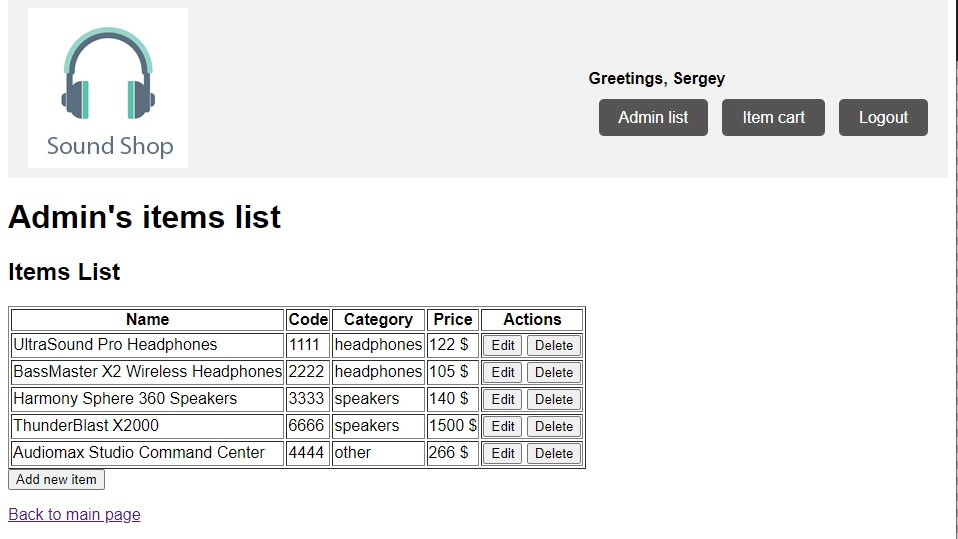
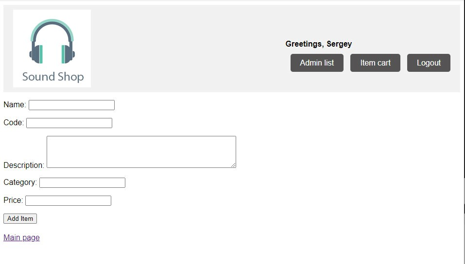
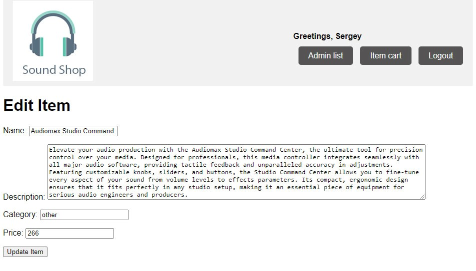

### Web app “Sound shop”
User interaction documentation

“Sound shop” is web application for selling high quality equipment for sound systems. It includes headphones, speakers, multimedia centers, cables and so on.
Application has three level of interaction with the user: for unregistered user, registered user, and administrator, each of them extending the possibilities of the previous one.

##### Unregistered user
Unregistered user can see items list, filter them by categories and view item’s details.
Items list:

Category filters:
 
##### Registered user
Unregistered user can register:
 
Users details are saved in the database, and from button “Login” user can login using email and password:
 
 

Logged in user will have possibilities to add items to cart, view cart and delete items from cart.
Details page for logged in user:

User’s cart:
 
 

##### Administrator

Administrator user can only be inserted into database manually. Besides regular registered user possibilities, admin user can add, delete or edit items, and for those actions there are:
admin item’s details page:
 
 
 
and admin item’s list:
 
 
 
Admin can add new item through Add Item form:
 

Also edit existing item’s details:
 
